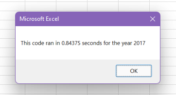
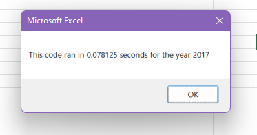
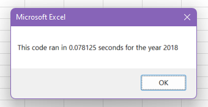

# VBA Stock Analysis 

## Overview of Project: 
The purpose of this analysis is to refactor code using Microsoft Excel VBA Scripting. The stock information is from 2017 and 2018, and will be used to determine whether or not the stocks are investing in. Refactoring this code is meant to make the code more efficient.

## Results: 

- The code ran before refactoring:
   
 
- The code ran after refactoring:

- The code ran before refactoring:

- The code ran after refactoring:

## Summary: 

Advantages of Refactoring Code
One advantage of refactoring code is the faster execution. The above photos show the time difference in how the code ran for each year. 
