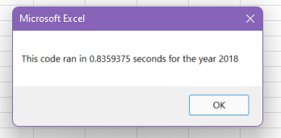

# VBA Stock Analysis 

## Overview of Project: 
The purpose of this analysis is to refactor code using Microsoft Excel VBA Scripting. The stock information is from 2017 and 2018, and will be used to determine whether or not the stocks are investing in. Refactoring this code is meant to make the code more efficient.

## Results: 

Using images and examples of your code, compare the stock performance between 2017 and 2018, as well as the execution times of the original script and the refactored script.

## Summary: 

In a summary statement, address the following questions.

Advantages of Refactoring Code
What are the advantages or disadvantages of refactoring code?

Pros and Cons of 

How do these pros and cons apply to refactoring the original VBA script?
